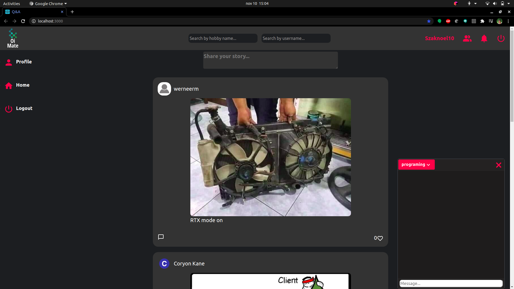

This project was bootstrapped with [Create React App](https://github.com/facebook/create-react-app).

## Description

This is a simple social media app.

### Implemented:

- Post system
- Comment system
- Like system
- Users
- Login, Registration
- Search system
- Notifications
- Chat by topics

## Available Scripts

In the project directory, you can run:

### `npm start`

Runs the app in the development mode. 
Open [http://localhost:3000](http://localhost:3000) to view it in the browser. But first you need to start the server: https://github.com/LJoel777/Q-A_spring_boot/tree/master

The page will reload if you make edits. 
You will also see any lint errors in the console.

## The final solution is on the develop brach.
